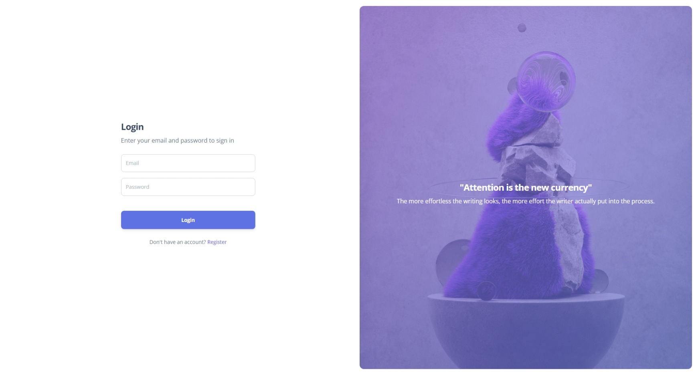

# Starter Code Argon

Laravel Version : 

Starter Code merupakan code awal yang digunakan dalam berbagai macam project. Dengan adanya starter code ini diharapkan developer atau pengembang dapat sedikit terbantu dikarenakan telah memiliki langkah awal dalam pengembangan sistemnya. Dalam repositori ini akan memiliki beberapa fitur dasar antara lain adalah Authentication Admin, Halaman Dashboard dengan menggunakan Argon serta CRUD dasar sebagai awal dari keseluruhan proses development atau pengembangan.

Dalam project ini menggunakan beberapa hal dasar seperti 
- [Laravel dengan](https://laravel.com/docs/9.x/) versi 9.x
- [Template Argon](https://www.creative-tim.com/product/argon-dashboard) Open Source

## Tampilan Awal Project
Tampilan Login

Tampilan Register

Tampilan Dashboard
